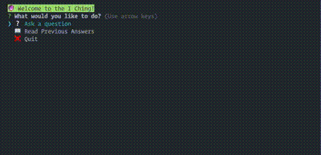

# Random I Ching Oracle

This project generates random hexagrams using the yarrow stalk method of the I Ching, an ancient Chinese oracle. The I Ching has 64 hexagrams that offer guidance for different situations. By creating a hexagram, you can explore the mysteries of the universe. 👻

You can save your hexagrams on your machine and see them in a colorful console.

# Installation

To install this project, you need to have Node.js and npm installed on your machine. Then, clone this repository and run `npm install` to install the dependencies.

# Usage

To generate a hexagram, run `node start` in the terminal, to start interactive console session. You can also press `Ctrl+C` to stop the process at any time.

To view your stored readings, other then console, can query the `./db/database.sqlite` file.

# Credits

* data json borrowed from [dkloke](https://github.com/dkloke/I-Ching-ref/tree/master)
* console colors by [chalk](https://www.npmjs.com/package/chalk)
